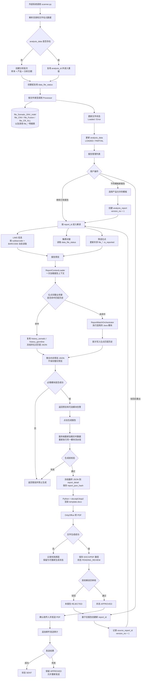
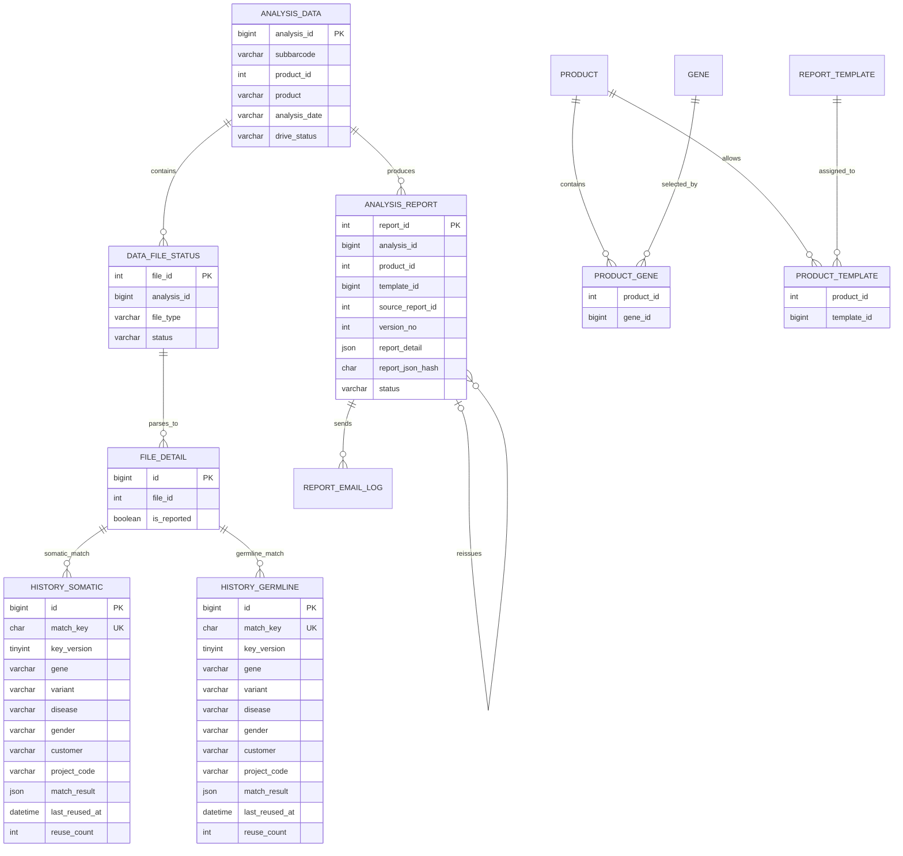
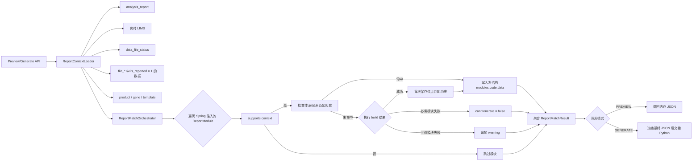
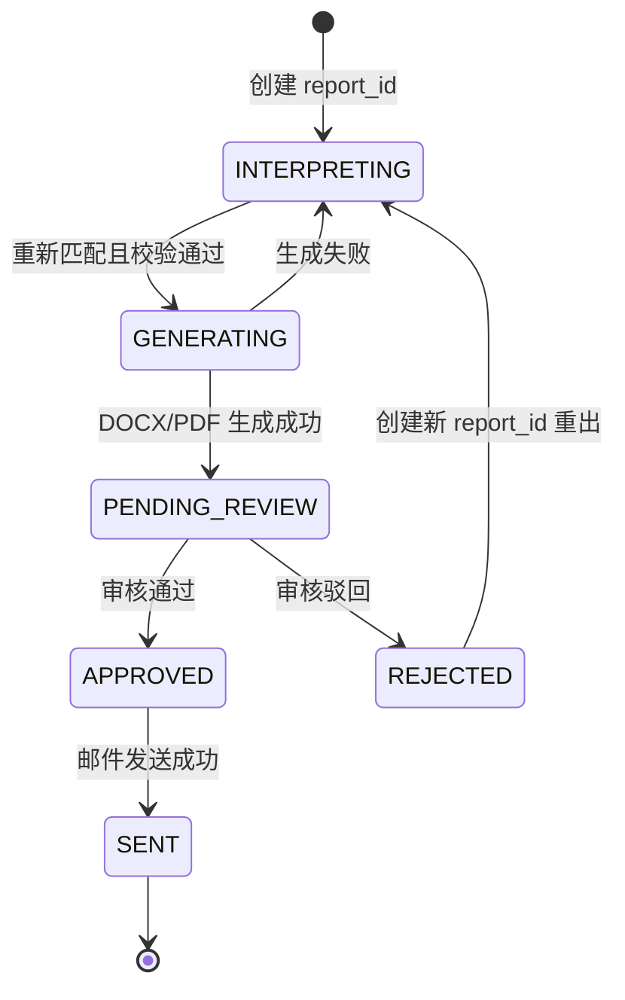
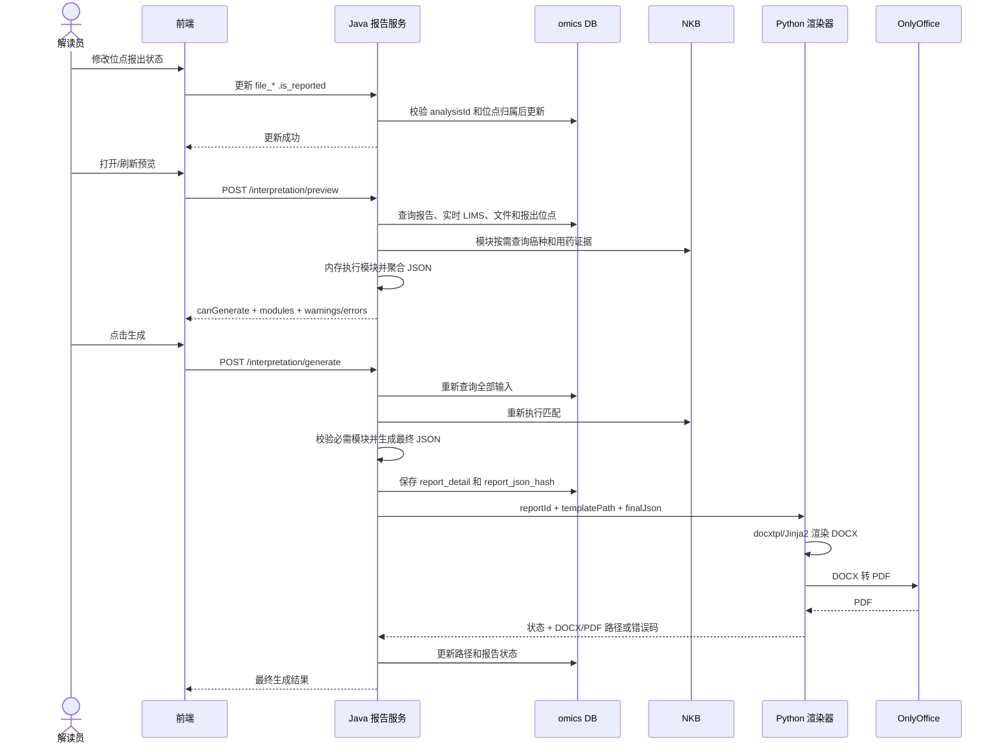

# 报告模块流程图

> 适用范围：`scanner.py` 数据入库、报告解读、位点筛选、内存预览、报告生成、审核和邮件发送。
>
> 本文描述简化后的目标架构。所有表关系均为逻辑关联，不建立数据库物理外键。详细表结构和模块接口见 [报告模块设计书](./report-module-design.md)。

## 1. 端到端业务流程

## 2. 逻辑数据关系

说明：

- 图中的连线只表达业务关系，数据库不创建物理外键。
- `FILE_DETAIL` 是逻辑名称，实际对应 `file_Somatic_SNV_Indel`、`file_CNV`、`file_Fusion`、`file_CR_ALL` 等表。
- `file_* .is_reported` 是分析级共享状态。不同报告在正式生成前可能互相影响；正式生成后以各自的 `report_detail` 为准。
- `history_somatic/history_germline` 保存单个位点**首次**匹配结果（复用键 v2 = 产品项目 + 癌种 + 性别 + 位点 + 人工改靶父级）：
  命中即**严格只读复用**（NKB 更新不刷新），并更新 `last_reused_at` / `reuse_count` + 写一条 `history_reuse_log` 留痕；
  完整预览仍只在内存中聚合，不落库。

## 3. Java 模块化预览流程

模块由代码自行定义 `code`、顺序、适用条件和必需性，不建设模块配置表。样本信息、位点、靶向用药、化疗、免疫、质控只是首批模块示例，不限制以后新增其他模块。

## 4. 报告状态机

状态约束：

- `INTERPRETING` 阶段允许修改共享位点状态并重复预览。
- 生成开始前必须重新执行全部适用模块，不能直接采用前端缓存的预览 JSON。
- `PENDING_REVIEW` 后不得覆盖 `report_detail`、JSON 哈希、模板或报告文件。
- 驳回后创建新报告，不覆盖旧报告的 JSON、DOCX、PDF 和审核记录。
- 邮件失败不回退审核状态，发送结果由邮件日志记录。

## 5. 预览和生成时序

## 6. 多报告及边界行为

- 不同模板：同一个 `analysis_id` 创建不同 `report_id`，通过 `product_template` 校验产品是否允许该模板。
- 驳回重出：新报告保存旧 `report_id` 到 `source_report_id`，`version_no` 在旧版本基础上加一。
- 多草稿：不加锁、不限制并行解读，接受共享 `file_* .is_reported` 导致最后一次修改影响全部未生成预览。
- 已生成报告：最终 JSON 已冻结，后续 LIMS、知识库或位点状态变化不会修改旧 `report_detail`。
- LIMS 多条：当前按 `BARCODE` 查询并取 `id` 最大的一条；没有记录或关键字段缺失时由对应必需模块阻止生成。
- 模块失败：必需模块失败阻止生成；可选模块失败保留预览并返回告警。
- Python/OnlyOffice 失败：不进入待审核，可修复后重新生成；成功后禁止覆盖原文件。
