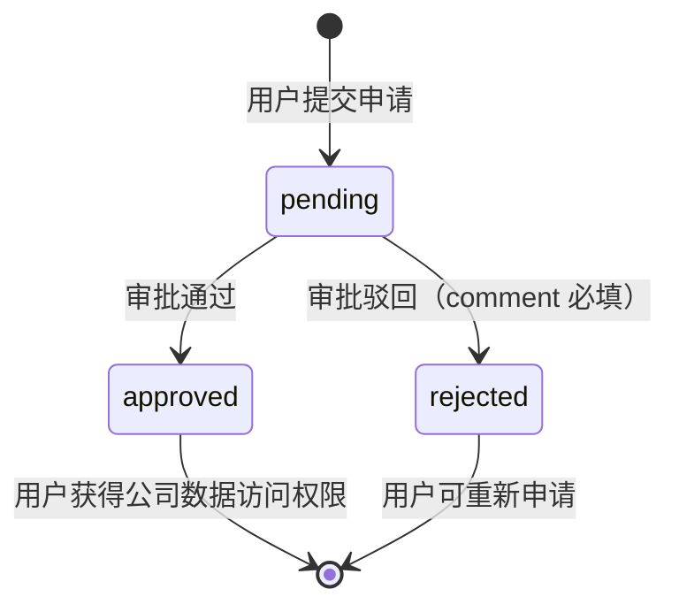

# 公司权限申请/审批 业务流程

> 生成时间：2026-09-17
> 分析范围：company-access 模块（申请 + 审批流）

## 流程概述

公司权限模块实现药企公司维度的数据隔离访问控制。3 个业务岗位角色（wet_lab / bioinformatician / interpreter）通过"申请-审批"流程获取指定公司的数据访问权限。operation_admin 作为审批人管理所有权限申请。

## 流程图

```mermaid
flowchart TD
    A[用户进入权限申请页\n/company-access] --> B[GET /api/company-access/companies]
    B --> C[返回未申请过的 active 公司列表]
    C --> D[用户选择公司 + 填写理由]
    D --> E[点击「提交申请」]
    E --> F[POST /api/company-access/apply]
    F --> G{同一公司已有\npending/approved 申请?}
    G -->|是| H[409 Conflict 提示]
    G -->|否| I[INSERT 申请\nstatus=pending]
    I --> J[刷新「我的申请」列表]
    J --> K[表格展示：公司/理由/状态/审批人/时间]
    H --> D

    L[用户进入审批页\n/company-access/approval] --> M[GET /api/company-access/pending]
    M --> N[展示待审批列表+申请人信息]
    N --> O[点击行内「通过」]
    N --> P[点击行内「驳回」]
    O --> Q[弹窗确认（可选意见）]
    P --> R[弹窗（意见必填）]
    Q --> S[POST /api/company-access/approve\n{approved: true}]
    R --> T[POST /api/company-access/approve\n{approved: false, comment}]
    S --> U[事务：UPDATE status=approved\n记录 approver+approvedAt]
    T --> V[事务：UPDATE status=rejected\n记录 approver+approveComment]
    U --> W[刷新待审批列表]
    V --> W

    classDef unimplemented stroke-dasharray: 5 5
```

## 状态流转



## 关键接口

| 步骤 | 方法 | 路径 | 权限 | 说明 |
|------|------|------|------|------|
| 可申请公司 | GET | /api/company-access/companies | apply:CompanyAccess | 未申请过的 active 公司 |
| 提交申请 | POST | /api/company-access/apply | apply:CompanyAccess | 重复申请 409 |
| 我的申请 | GET | /api/company-access/my-applications | apply:CompanyAccess | 历史申请记录 |
| 待审批列表 | GET | /api/company-access/pending | approve:CompanyAccess | 全部待审批记录 |
| 审批操作 | POST | /api/company-access/approve | approve:CompanyAccess | 原子事务更新 |