# 数据周期管理 业务流程

> 生成时间：2026-09-17
> 分析范围：data-retention 模块（策略配置 + 归档管理 + 自动化扫描）

## 流程概述

数据周期管理模块为报告数据提供自动化的生命周期管理。operation_admin 配置产品相关的数据保留策略，系统每日凌晨自动扫描到期数据并生成待归档记录，用户手动确认归档标记。

## 流程图

```mermaid
flowchart TD
    subgraph 策略配置
        A1[用户进入页面\n/system/data-retention] --> A2[Tab「周期策略」]
        A2 --> A3[GET /api/data-retention/policies]
        A3 --> A4[展示策略列表表格]
        A4 --> A5[新增/编辑]
        A5 --> A6[策略表单：名称/关联产品/保留月数/起算基准/备注]
        A6 --> A7[POST /api/data-retention/policies/save]
        A7 --> A3
        A4 --> A8[删除策略]
        A8 --> A9[AlertDialog 确认]
        A9 --> A10[DELETE /api/data-retention/policies/:id]
        A10 --> A3
    end

    subgraph 归档管理
        B1[Tab「待归档清单」] --> B2[POST /api/data-retention/archives/page]
        B2 --> B3[表格：reportId/策略名称/到期日/状态/操作]
        B3 --> B4[筛选：status 下拉 / 产品搜索]
        B4 --> B2
        B3 --> B5[「标记已归档」]
        B5 --> B6[POST /api/data-retention/archives/:id/mark-archived]
        B6 --> B2
    end

    subgraph 自动化扫描
        C1[每日 03:00 cron 触发器] --> C2[扫描所有 active 策略]
        C2 --> C3[按 productId 锁定产品]
        C3 --> C4{产品策略/全局策略?}
        C4 -->|特定产品| C5[筛选该产品的报告]
        C4 -->|全局| C6[筛选未被产品策略覆盖的报告]
        C5 --> C7[取 startBasis 日期字段\nreportSentAt 或 analysisDate]
        C6 --> C7
        C7 --> C8[到期日 = startBasis + retentionMonths]
        C8 --> C9{到期日 < 今天?}
        C9 -->|是| C10[INSERT data_archive_record\nreportId 唯一 + onConflictDNU 幂等]
        C9 -->|否| C11[跳过]
        C10 --> C12[继续下一条]
        C11 --> C12
    end

    classDef unimplemented stroke-dasharray: 5 5
```

## 关键接口

| 步骤 | 方法 | 路径 | 权限 | 说明 |
|------|------|------|------|------|
| 策略列表 | GET | /api/data-retention/policies | manage:DataRetention | 全量策略 |
| 策略保存 | POST | /api/data-retention/policies/save | manage:DataRetention | 新增/更新 |
| 策略删除 | DELETE | /api/data-retention/policies/:id | manage:DataRetention | 删除 |
| 归档查询 | POST | /api/data-retention/archives/page | manage:DataRetention | 分页+筛选 |
| 标记归档 | POST | /api/data-retention/archives/:id/mark-archived | manage:DataRetention | 状态更新 |