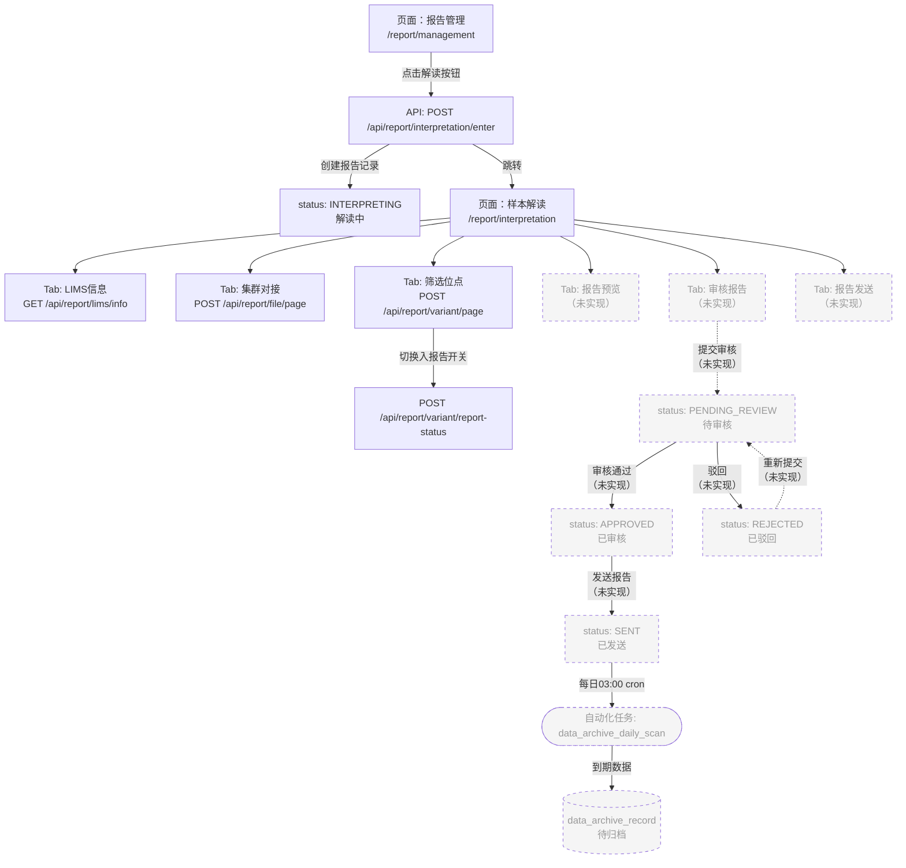
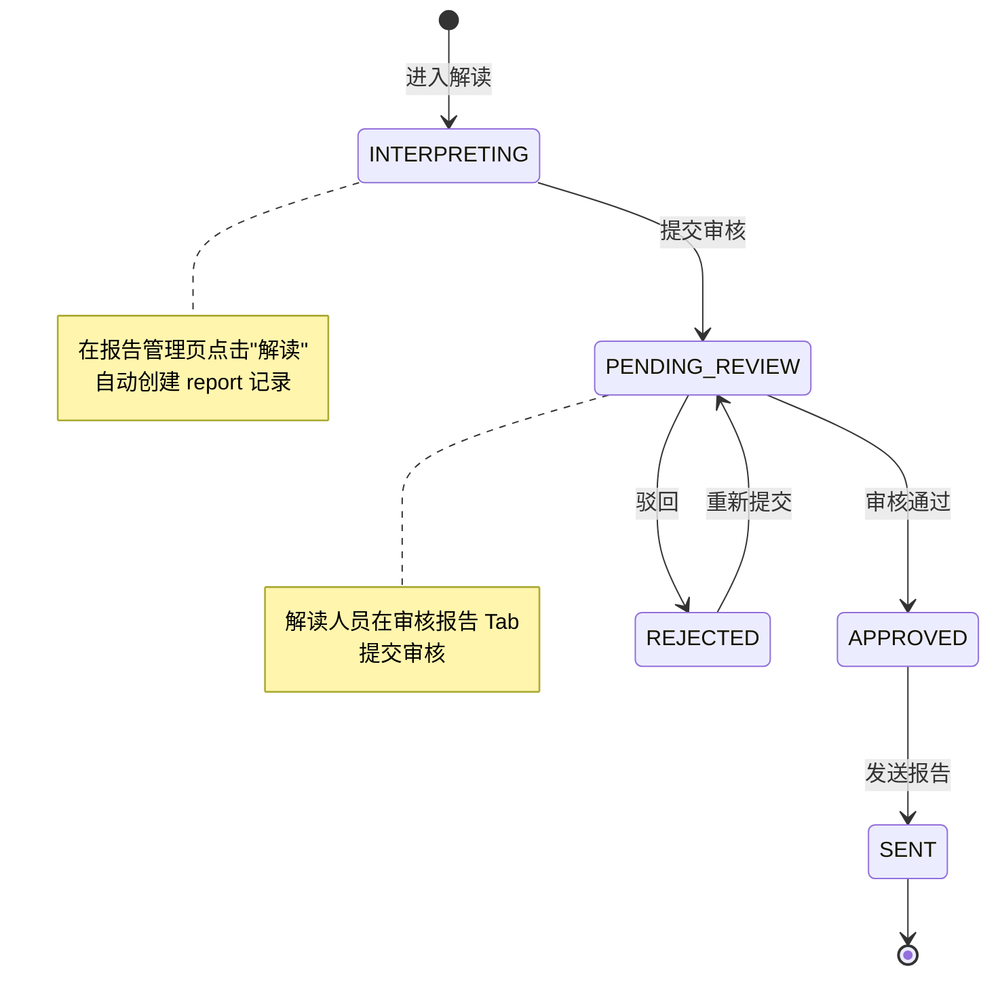

# 报告生成 业务流程

> 生成时间：2026-09-08
> 分析范围：`server/modules/report/` + `client/src/pages/ReportManagement/` + `client/src/pages/ReportInterpretation/`

## 流程概述

报告生成从分析数据就绪开始，经过**解读 → 审核 → 发送**三个核心阶段，共 5 个状态。流程入口在报告管理页面，操作列点击"解读"按钮进入样本解读页面，该页面包含 6 个 Tab（LIMS 信息、集群对接、筛选位点、报告预览、审核报告、报告发送）。目前筛选位点及之前的功能已实现，审核、发送、预览尚在开发中。

## 流程图

## 状态流转图

## 关键接口

| 步骤 | 方法 | 路径 | 权限 | 说明 |
|------|------|------|------|------|
| 报告列表 | POST | `/api/report/case/page` | `read:Report` | 分页查询，含 QC 判定 |
| 进入解读 | POST | `/api/report/interpretation/enter` | `read:Interpretation` | 创建/获取报告记录 |
| 解读上下文 | GET | `/api/report/interpretation/context` | `read:Interpretation` | 获取解读页上下文 |
| 文件列表 | POST | `/api/report/file/page` | `read:File` | 集群对接文件分页 |
| 文件内容 | GET | `/api/report/file/content` | `read:File` | 查看文件内容 |
| 变异位点 | POST | `/api/report/variant/page` | `read:Variant` | 按类型分页 |
| 入报告开关 | POST | `/api/report/variant/report-status` | `update:VariantReportStatus` | 切换位点是否入报告 |
| LIMS 信息 | GET | `/api/report/lims/info` | `read:LimsInfo` | 样本信息查询 |

## 涉及角色

| 角色 | 权限 | 职责 |
|------|------|------|
| `interpreter`（报告解读员） | `read:Interpretation`, `read:Variant`, `update:VariantReportStatus` | 进入解读、筛选位点、提交审核 |
| `operation_admin`（运营管理员） | 全权限 | 可查看所有报告（含 company_id=NULL 的存量数据） |

## 未实现功能

1. **报告预览 Tab** — 预览报告内容
2. **审核报告 Tab** — 提交审核、审核通过/驳回
3. **报告发送 Tab** — 发送报告（虽然数据库已预留 `reportSentBy`、`reportSentAt` 字段）
4. **数据归档实际操作** — 自动任务已生成待归档记录，但实际归档操作（文件搬迁/删除）未实现