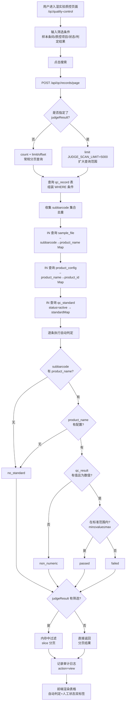
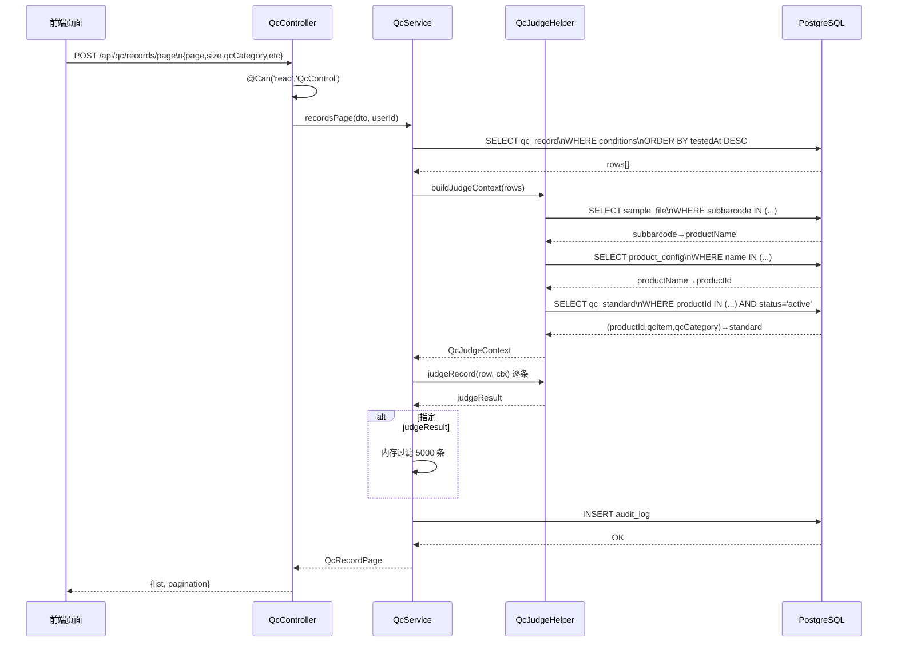

# 湿实验质控 业务流程

> 生成时间：2026-09-17
> 分析范围：qc 模块（质控记录查询 + 自动判定 + Excel 导入）

## 流程概述

湿实验质控模块为湿实验员和运营管理员提供质控记录的检索查看功能，核心业务逻辑是**自动判定**：通过 subbarcode 关联样本和产品，再关联质控标准，将每一条质控结果与标准上下限进行比较，自动输出 passed / failed / non_numeric / no_standard 四种判定结果。

## 流程图

### 1. 完整业务流程（质控查询 + 自动判定）



### 2. API 调用链路（时序图）



### 3. Excel 批量导入流程

```mermaid
flowchart TD
    A[用户上传 Excel] --> B[POST /api/sample-qc-info/import\nmultipart/form-data]
    B --> C[校验 file 存在\n扩展名 .xlsx/.xls]
    C --> D[解析 Excel\nXLSX.read(fileBuffer)]
    D --> E[读取首行作为表头\n→ 硬编码映射表]
    E --> F[逐行处理]
    F --> G{按 sample_date +\nsample_code 匹配 sample?}
    G -->|匹配| H{sample_qc_info\n已存在?}
    H -->|是| I[DB UPDATE]
    H -->|否| J[DB INSERT]
    G -->|未匹配| K[记录错误\n{row,sampleDate,sampleCode,message}]
    I --> L[继续]
    J --> L
    K --> L
    L --> F
    F -.- M[同时计算\nbeforeDuplicate 派生字段]
    M --> F
    F -.- N[所有行处理完毕]
    N --> O[返回导入结果\n{total,success,failed,errors}]

    classDef unimplemented stroke-dasharray: 5 5
```

## 关键接口

| 步骤 | 方法 | 路径 | 权限 | 说明 |
|------|------|------|------|------|
| 分页查询 | POST | /api/qc/records/page | read:QcControl | 质控记录查询含自动判定 |
| 获取详情 | GET | /api/sample-qc-info/:sampleId | read:Report | 样本质控详细指标 |
| 创建详情 | POST | /api/sample-qc-info | manage:Report | 手工录入样本质控 |
| 更新详情 | PUT | /api/sample-qc-info/:sampleId | manage:Report | 编辑样本质控 |
| Excel 导入 | POST | /api/sample-qc-info/import | manage:Report | 批量导入 30+ 项指标 |
| 标准分页 | POST | /api/qc-standard/page | manage:QcStandard | 质控标准配置列表 |
| 标准保存 | POST | /api/qc-standard/save | manage:QcStandard | 新增/编辑质控标准 |
| 标准删除 | DELETE | /api/qc-standard/:id | manage:QcStandard | 删除质控标准 |

## 状态表

| 资源 | 字段 | 枚举值 | 含义 |
|------|------|--------|------|
| qc_record.status | 人工状态 | pending | 待确认 |
| | | passed | 通过 |
| | | failed | 未通过 |
| qc_record (自动) | judgeResult | passed | 合格（自动判定通过） |
| | | failed | 不合格（超限） |
| | | non_numeric | 非数值（结果不可比较） |
| | | no_standard | 无标准（产品/标准未配置） |
| qc_standard.status | 启用状态 | active | 启用（参与判定） |
| | | inactive | 停用（不参与判定） |

## 未实现功能

- 质控记录的人工状态标注修改（qty 无独立更新接口，人工标注由关联业务操作设定）
- 质控记录的导出功能