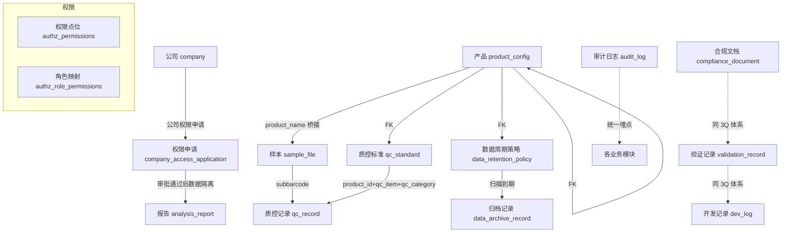

# 系统设计文档索引

> 生成时间：2026-09-17
> 应用范围：Biotech 管理系统（不含报告管理）

---

## 模块清单

| 序号 | 模块名称 | 路由 | 文档 | 流程图 |
|------|---------|------|------|--------|
| 1 | 湿实验质控 | /qc/quality-control | [spec.md](spec.md) | [wetlab-qc-flow.md](../../docs/flowchart/wetlab-qc-flow.md) |
| 2 | 生信质控 | /qc/bio-qc | [bioinfo-qc.md](bioinfo-qc.md) | 参考湿实验质控（qc_category 不同） |
| 3 | 公司管理 | /company/management | [company-management.md](company-management.md) | 嵌入文档 |
| 4 | 权限申请 | /company-access | [company-access.md](company-access.md) | 嵌入文档 |
| 5 | 权限审批 | /company-access/approval | [company-access.md](company-access.md) | 嵌入文档 |
| 6 | 审计日志 | /audit/logs | [audit-log.md](audit-log.md) | 嵌入文档 |
| 7 | 3Q 文档管理 | /compliance/documents | [compliance-docs.md](compliance-docs.md) | 嵌入文档 |
| 8 | 开发记录 | /compliance/dev-log | [dev-log.md](dev-log.md) | 嵌入文档 |
| 9 | 3Q 验证记录 | /compliance/validation-records | [validation-record.md](validation-record.md) | 嵌入文档 |
| 10 | 产品配置 | /system/product-config | [product-config.md](product-config.md) | 嵌入文档 |
| 11 | 数据周期管理 | /system/data-retention | [data-retention.md](data-retention.md) | 嵌入文档 |
| 12 | 系统管理 | /system/* | [system-management.md](system-management.md) | 嵌入文档 |

---

## 模块间数据关系总览

---

## 角色权限矩阵（汇总）

| 权限点位 | wet_lab | bioinformatician | interpreter | operation_admin |
|---------|:---:|:---:|:---:|:---:|
| read:QcControl | ✅ | ✅(bioinfo) | ❌ | ✅ |
| manage:QcStandard | ✅ | ❌ | ❌ | ✅ |
| read:ProductConfig | ✅ | ✅ | ✅ | ✅ |
| manage:ProductConfig | ❌ | ❌ | ❌ | ✅ |
| manage:DataRetention | ❌ | ❌ | ❌ | ✅ |
| manage:ComplianceDoc | ❌ | ❌ | ❌ | ✅ |
| read:ComplianceRecord | ✅ | ✅ | ✅ | ✅ |
| manage:ComplianceRecord | ❌ | ❌ | ❌ | ✅ |
| read:AuditLog | ✅ | ✅ | ✅ | ✅ |
| apply:CompanyAccess | ✅ | ✅ | ✅ | ✅ |
| approve:CompanyAccess | ❌ | ❌ | ❌ | ✅ |
| manage:Company | ❌ | ❌ | ❌ | ✅ |
| manage:Permission | ❌ | ❌ | ❌ | ✅ |