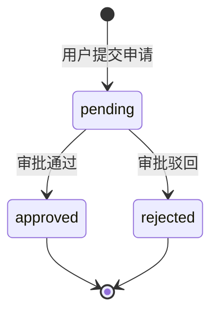

# 公司权限申请 / 审批模块设计文档

> 路由：/company-access（申请） /company-access/approval（审批）
> 角色：wet_lab / bioinformatician / interpreter 可申请；operation_admin 可审批

---

## 1. 数据模型

### company_access_application（权限申请表）

| 字段 | 类型 | 约束 | 说明 |
|------|------|------|------|
| id | uuid | PK, defaultRandom | 主键 |
| applicant | user_profile | NOT NULL | 申请人（custom type → string） |
| company_id | uuid | NOT NULL, FK→company.id | 申请的公司 |
| reason | varchar(500) | - | 申请理由 |
| status | varchar(20) | NOT NULL, default 'pending' | pending（待审批）/ approved（通过）/ rejected（驳回） |
| approver | user_profile | - | 审批人 |
| approved_at | timestamptz | - | 审批时间 |
| approve_comment | varchar(500) | - | 审批意见（驳回时必填） |
| _created_at | timestamptz | NOT NULL | 创建时间 |

**索引**：`idx_caa_company`(company_id)、`idx_caa_status`(status)

---

## 2. API 接口

| 方法 | 路径 | 权限 | 说明 |
|------|------|------|------|
| GET | /api/company-access/companies | apply:CompanyAccess | 可申请的公司列表（未申请过的 active 公司） |
| POST | /api/company-access/apply | apply:CompanyAccess | 提交申请 |
| GET | /api/company-access/my-applications | apply:CompanyAccess | 我的申请列表 |
| GET | /api/company-access/pending | approve:CompanyAccess | 待审批列表 |
| POST | /api/company-access/approve | approve:CompanyAccess | 原子审批（通过/驳回） |

---

## 3. 业务逻辑

### 3.1 申请
- 同一公司已有 `pending` 或 `approved` 状态的申请 → 409 禁止重复申请
- 创建记录时 status=`pending`，applicant 从 `req.userContext.userId` 获取

### 3.2 审批
- 事务内原子更新：校验当前 status 是否为 `pending`（非 pending 409）
- 审批通过：status→`approved`，记录 approver / approvedAt
- 审批驳回：status→`rejected`，approveComment 必填，记录 approver
- 通过审批后，该申请人在该公司有数据访问权限（行级 RLS 过滤）

---

## 4. 功能流程

```mermaid
flowchart TD
    subgraph 申请流程
        A[页面：我的权限申请\n/company-access] --> B[GET 可申请公司列表]
        B --> C[选择公司 + 填写理由]
        C --> D[POST /api/company-access/apply]
        D --> E{同一公司已有\npending/approved?}
        E -->|是| F[409 拒绝]
        E -->|否| G[INSERT status=pending\napply_company_access 审计]
        G --> H[刷新「我的申请」列表]
        F --> C
    end

    subgraph 审批流程
        I[页面：权限审批\n/company-access/approval] --> J[GET /api/company-access/pending]
        J --> K[渲染待审批列表\n申请人/公司/理由/时间]
        K --> L[点击「通过」或「驳回」]
        L --> M{驳回时意见必填}
        M --> N[POST /api/company-access/approve\n{id, approved:true/false, comment?}]
        N --> O{事务内状态校验}
        O -->|非 pending| P[409 冲突]
        O -->|pending| Q[UPDATE status+approver\napprove/reject 审计]
        Q --> R[刷新待审批列表]
    end

    classDef unimplemented stroke-dasharray: 5 5
```

---

## 5. 状态流转



---

## 6. 角色与权限

| 角色 | apply:CompanyAccess | approve:CompanyAccess |
|------|:---:|:---:|
| wet_lab | ✅ | ❌ |
| bioinformatician | ✅ | ❌ |
| interpreter | ✅ | ❌ |
| operation_admin | ✅ | ✅ |