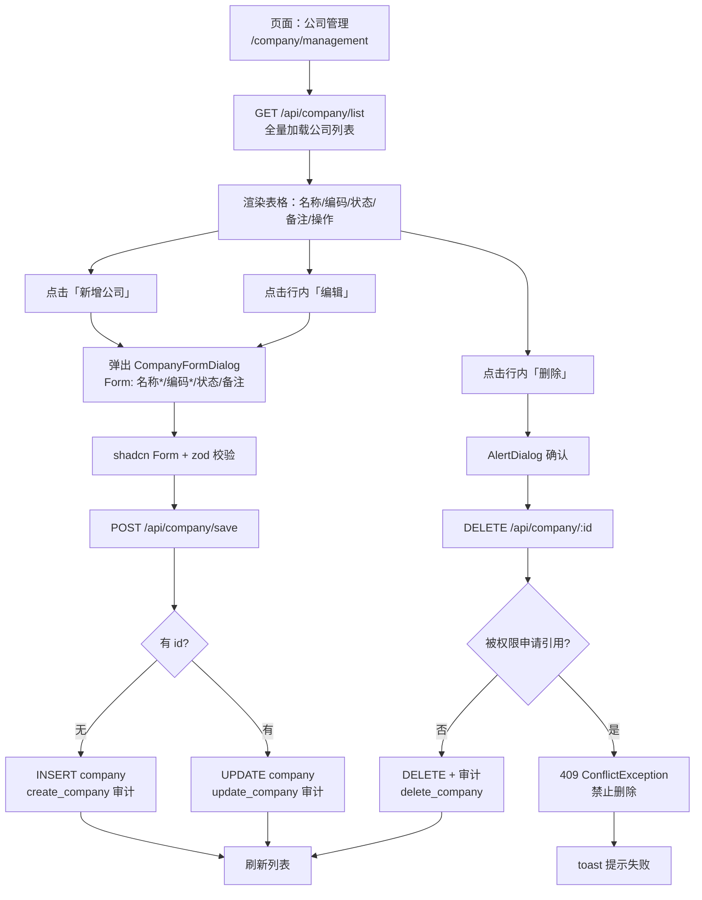

# 公司管理模块设计文档

> 路由：/company/management | 角色：operation_admin

---

## 1. 数据模型

### company（公司表）

| 字段 | 类型 | 约束 | 说明 |
|------|------|------|------|
| id | uuid | PK, defaultRandom | 主键 |
| name | varchar(120) | NOT NULL | 公司名称 |
| code | varchar(60) | NOT NULL, UNIQUE | 公司编码 |
| status | varchar(20) | NOT NULL, default 'active' | 状态：active / inactive |
| remark | varchar(500) | - | 备注 |
| _created_at | timestamptz | NOT NULL | 系统创建时间 |
| _created_by | user_profile | - | 创建者 |
| _updated_at | timestamptz | NOT NULL | 更新时间 |
| _updated_by | user_profile | - | 更新者 |

---

## 2. API 接口

| 方法 | 路径 | 权限 | 说明 |
|------|------|------|------|
| GET | /api/company/list | manage:Company | 全量公司列表 |
| POST | /api/company/save | manage:Company | 新增/更新（有 id 更新，无 id 创建） |
| DELETE | /api/company/:id | manage:Company | 删除（有权限申请引用时 409 拒绝） |

---

## 3. 业务逻辑

- **新增**：验证 code 唯一性（数据库唯一约束 + 23505 异常捕获转 ConflictException）
- **更新**：根据传入 id 定位记录，更新字段仅含请求中提供的字段
- **删除**：先检查 `company_access_application` 表是否引用该公司 → 有引用则抛 ConflictException 禁止删除
- **审计**：create/update/delete 均记录 `audit_log`（action: create_company / update_company / delete_company）

---

## 4. 功能流程

---

## 5. 角色与权限

| 角色 | manage:Company |
|------|:---:|
| wet_lab | ❌ |
| bioinformatician | ❌ |
| interpreter | ❌ |
| operation_admin | ✅ |