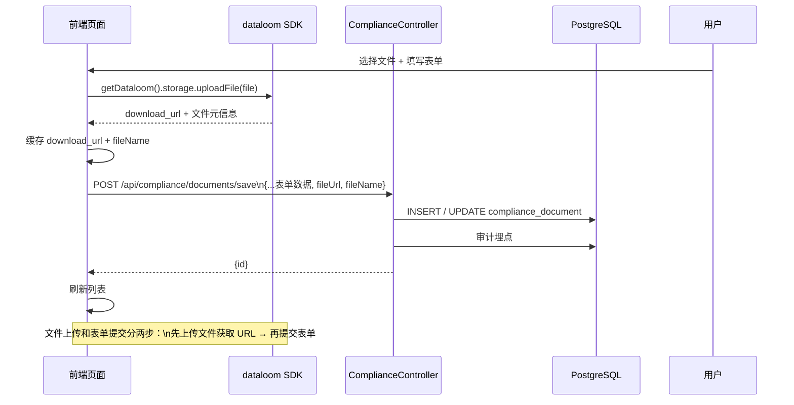

# 3Q 文档管理模块设计文档

> 路由：/compliance/documents | 角色：operation_admin

---

## 1. 数据模型

### compliance_document（合规文档表）

| 字段 | 类型 | 约束 | 说明 |
|------|------|------|------|
| id | uuid | PK, defaultRandom | 主键 |
| doc_type | varchar(20) | NOT NULL | 文档类型：IQ / OQ / PQ / DEV_TEST |
| title | varchar(200) | NOT NULL | 文档标题 |
| version | varchar(50) | NOT NULL | 版本号 |
| file_name | varchar(200) | - | 上传的原始文件名 |
| file_url | text | - | 文件下载 URL（dataloom 存储） |
| remark | varchar(500) | - | 备注 |
| _created_at | timestamptz | NOT NULL | 创建时间 |
| _created_by | user_profile | - | 创建者 |
| _updated_at | timestamptz | NOT NULL | 更新时间 |
| _updated_by | user_profile | - | 更新者 |

**索引**：`idx_compliance_doc_type`(doc_type)

---

## 2. API 接口

| 方法 | 路径 | 权限 | 说明 |
|------|------|------|------|
| GET | /api/compliance/documents | manage:ComplianceDoc | 全量文档列表（支持 docType 筛选） |
| POST | /api/compliance/documents/save | manage:ComplianceDoc | 新增/更新文档 |
| DELETE | /api/compliance/documents/:id | manage:ComplianceDoc | 删除文档 |

---

## 3. 文件上传逻辑



---

## 4. 功能流程

```mermaid
flowchart TD
    A[页面：3Q文档管理\n/compliance/documents] --> B[GET /api/compliance/documents\n全量加载]
    B --> C[渲染表格：\n类型可筛选(IQ/OQ/PQ/DEV_TEST)]
    
    C --> D[点击「新增」或行内「编辑」]
    D --> E[弹出 ComplianceDocFormDialog]
    E --> F[shadcn Form + zod\n标题*/类型*/版本*/备注]
    E --> G[文件上传区\n选择文件→dataloom 上传→存 URL]
    F --> H[POST /api/compliance/documents/save]
    G --> H
    
    C --> I[行内「删除」]
    I --> J[AlertDialog 确认]
    J --> K[DELETE /api/compliance/documents/:id]
```

---

## 5. 角色与权限

| 角色 | manage:ComplianceDoc |
|------|:---:|
| wet_lab | ❌ |
| bioinformatician | ❌ |
| interpreter | ❌ |
| operation_admin | ✅ |