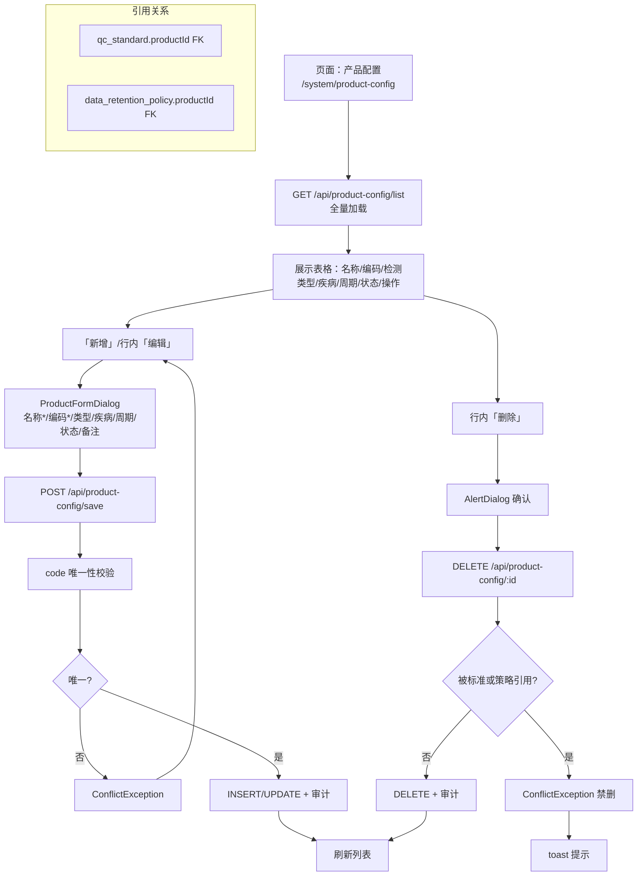

# 产品配置模块设计文档

> 路由：/system/product-config | 角色：operation_admin（管理） / 全部 4 角色（查看产品列表供下拉使用）

---

## 1. 数据模型

### product_config（产品配置表）

| 字段 | 类型 | 约束 | 说明 |
|------|------|------|------|
| id | uuid | PK, defaultRandom | 主键 |
| name | varchar(120) | NOT NULL | 产品名称，关联 sample_file.product_name、QC 自动判定链 |
| code | varchar(60) | NOT NULL, UNIQUE | 产品编码 |
| test_type | varchar(60) | - | 检测类型 |
| related_diseases | varchar(500) | - | 相关疾病 |
| report_cycle_days | integer | - | 报告周期（天） |
| status | varchar(20) | NOT NULL, default 'active' | active / inactive |
| remark | varchar(500) | - | 备注 |
| _created_at / _created_by | - | 系统字段 | - |
| _updated_at / _updated_by | - | 系统字段 | - |

---

## 2. API 接口

| 方法 | 路径 | 权限 | 说明 |
|------|------|------|------|
| GET | /api/product-config/list | read:ProductConfig | 全量列表（支持 `activeOnly=true` 参数，报告页下拉取 active 产品） |
| POST | /api/product-config/save | manage:ProductConfig | 新增/更新（code 唯一校验） |
| DELETE | /api/product-config/:id | manage:ProductConfig | 删除（被 qc_standard 或 data_retention_policy 引用时 409 禁删） |

---

## 3. 业务逻辑

- **删除保护**：删除时检查 `qc_standard` 和 `data_retention_policy` 表中是否引用了该 product_id，有引用则抛 ConflictException
- **前端下拉**：报告管理/质控标准页面的产品下拉仅取 `activeOnly=true` 的活跃产品
- **自动判定桥接**：产品配置是 QC 自动判定链中的关键桥梁：`qc_record.subbarcode → sample_file.product_name → product_config.id → qc_standard.product_id`

---

## 4. 功能流程

---

## 5. 角色与权限

| 角色 | read:ProductConfig | manage:ProductConfig |
|------|:---:|:---:|
| wet_lab | ✅ | ❌ |
| bioinformatician | ✅ | ❌ |
| interpreter | ✅ | ❌ |
| operation_admin | ✅ | ✅ |