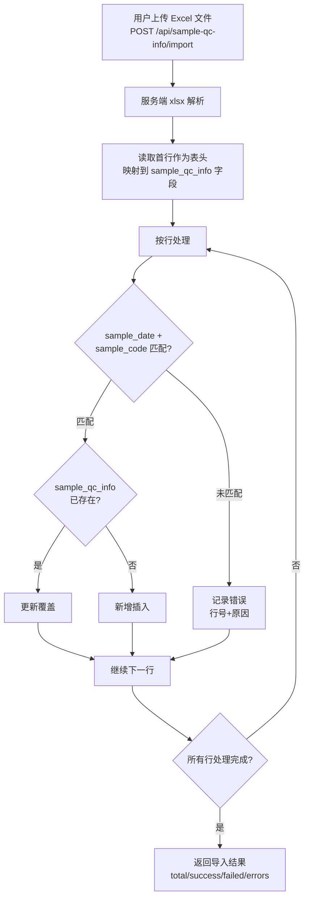

# 湿实验质控模块设计文档

> 生成时间：2026-09-17
> 分析范围：QcQualityControl（湿实验质控列表）/ QcStandard（质控标准配置，配套功能）/ SampleQcInfo（样本质控详情）/ ProductConfig（产品配置，配套功能）

---

## 1. 数据模型

### 1.1 qc_record（质控记录表）

质控核心数据存储，记录从 LIMS 系统同步的每一项质控检测数据。

| 字段 | 类型 | 约束 | 说明 |
|------|------|------|------|
| id | uuid | PK, defaultRandom | 主键 |
| subbarcode | varchar(80) | NOT NULL | 样本条码，关联 sample_file.subbarcode |
| qc_item | varchar(100) | NOT NULL | 质控项目名称，如 mapping_rate、average_depth |
| qc_result | varchar(50) | - | 质控结果数值（字符串形式，如 "98.5"） |
| status | varchar(20) | NOT NULL, default 'pending' | 人工确认状态：pending（待确认）、passed（通过）、failed（未通过） |
| operator | varchar(80) | - | 操作员 |
| tested_at | timestamptz | - | 检测时间 |
| remark | varchar(500) | - | 备注 |
| qc_category | varchar(20) | NOT NULL, default 'wet_lab' | 质控类别：wet_lab（湿实验）、bioinfo（生信） |
| _created_at | timestamptz | NOT NULL, 系统自动 | 创建时间 |
| _created_by | user_profile | 系统自动 | 创建者 |
| _updated_at | timestamptz | NOT NULL, 系统自动 | 更新时间 |
| _updated_by | user_profile | 系统自动 | 更新者 |

**索引**：`idx_qc_record_subbarcode`（subbarcode）

### 1.2 qc_standard（质控标准表）

按产品、质控类别、质控项目配置的合格判定上下限标准。

| 字段 | 类型 | 约束 | 说明 |
|------|------|------|------|
| id | uuid | PK, defaultRandom | 主键 |
| product_id | uuid | NOT NULL, FK→product_config.id | 关联产品 |
| qc_item | varchar(100) | NOT NULL | 质控项目名称，与 qc_record.qc_item 对应 |
| min_value | varchar(50) | - | 合格下限（NULL 表示不设下限） |
| max_value | varchar(50) | - | 合格上限（NULL 表示不设上限） |
| unit | varchar(30) | - | 单位（如 %、X 等） |
| status | varchar(20) | NOT NULL, default 'active' | 状态：active（启用）、inactive（停用） |
| remark | varchar(500) | - | 备注 |
| qc_category | varchar(20) | NOT NULL, default 'wet_lab' | 质控类别：wet_lab、bioinfo |
| _created_at / _created_by | - | 同 system field | - |
| _updated_at / _updated_by | - | 同 system field | - |

**唯一约束**：唯一索引 (product_id, qc_item, qc_category)

### 1.3 product_config（产品配置表）

产品基础信息，在质控自动判定链路中作为样本与标准的桥接。

| 字段 | 类型 | 约束 | 说明 |
|------|------|------|------|
| id | uuid | PK, defaultRandom | 主键 |
| name | varchar(120) | NOT NULL | 产品名称，关联 sample_file.product_name |
| code | varchar(60) | NOT NULL, UNIQUE | 产品编码 |
| test_type | varchar(60) | - | 检测类型 |
| related_diseases | varchar(500) | - | 相关疾病 |
| report_cycle_days | integer | - | 报告周期（天） |
| status | varchar(20) | NOT NULL, default 'active' | 状态：active/inactive |
| remark | varchar(500) | - | 备注 |
| _created_at / _created_by | - | 同 system field | - |
| _updated_at / _updated_by | - | 同 system field | - |

### 1.4 sample_file（样本文件表）

样本基础信息表，提供 subbarcode 到产品名称的映射。

| 字段 | 类型 | 说明 |
|------|------|------|
| sample_id | uuid (PK) | 主键 |
| subbarcode | varchar(80) | 样本条码（关联 qc_record.subbarcode） |
| barcode | varchar(80) | 条码 |
| patient_id | varchar(80) | 患者编号 |
| person_name | varchar(80) | 患者姓名 |
| gender | varchar(10) | 性别 |
| birthday | varchar(20) | 出生日期 |
| age | varchar(10) | 年龄 |
| patient_phone | varchar(40) | 患者电话 |
| hospital | varchar(120) | 医院 |
| received_date | varchar(20) | 接收日期 |
| specimen_type | varchar(60) | 样本类型 |
| specimen_quantity | varchar(60) | 样本数量 |
| testing_program | varchar(120) | 检测方案 |
| disease_type | varchar(120) | 疾病类型 |
| client | varchar(120) | 客户 |
| commission_date | varchar(20) | 委托日期 |
| product_name | varchar(120) | 产品名称（关联 product_config.name） |
| ... | varchar(...) | 其他样本元信息字段 |

### 1.5 sample_qc_info（样本质控详细信息表）

通过 Excel 批量导入的湿实验详细质控数据，存储测序、比对、覆盖度等 30+ 项详细指标。

| 字段 | 类型 | 说明 |
|------|------|------|
| id | uuid (PK) | 主键 |
| sample_id | uuid (UNIQUE) | 关联样本 ID |
| lib_id | varchar(128) | 文库编号 |
| raw_base | varchar(128) | 原始数据量（bp） |
| raw_q20 / raw_q30 | varchar(128) | Q20/Q30 质量分数 |
| raw_gc | varchar(128) | GC 含量 |
| mapping_rate | varchar(128) | 比对率 |
| duplicate | varchar(128) | 重复率 |
| average_depth | varchar(128) | 平均测序深度 |
| coverage_target | varchar(128) | 目标区域覆盖度 |
| coverage_target_50x/500x/1000x | varchar(128) | 不同深度的覆盖度 |
| total_reads | varchar(128) | 总 reads 数 |
| contamination_level | varchar(128) | 污染水平 |
| probe_capture_ratio | varchar(128) | 探针捕获率 |
| ... | varchar(128) | 另有 20+ 项指标（所有数值字段统一 varchar） |

**数据结构特点**：所有数值字段统一存储为 varchar(128)，便于 Excel 导入和灵活扩展，数值比较在代码层通过 parseFloat 转换。

---

## 2. 业务逻辑：自动判定算法

### 2.1 判定链路

```
qc_record.subbarcode
    ↓ JOIN sample_file ON subbarcode
    → sample_file.product_name
    ↓ JOIN product_config ON name
    → product_config.id
    ↓ JOIN qc_standard ON product_id + qc_item + qc_category
    → min_value / max_value
    ↓ 数值比较
    → judgeResult（passed / failed / non_numeric / no_standard）
```

### 2.2 判定规则

| 条件 | 判定结果 | 含义 |
|------|----------|------|
| 样本无对应 product_name | no_standard | 无标准 |
| 产品无对应质控标准配置 | no_standard | 无标准 |
| qc_result 为空或非数字字符串 | non_numeric | 非数值 |
| qc_result < min_value（min_value 不为空） | failed | 不合格 |
| qc_result > max_value（max_value 不为空） | failed | 不合格 |
| 全部在标准范围内 | passed | 合格 |

### 2.3 批量判定流程（代码中 qc-judge-helper.ts）

1. 收集查询结果中所有唯一的 subbarcode
2. 批量查询 sample_file 获取 subbarcode → product_name 映射
3. 收集所有 product_name 查询 product_config 获取 product_name → id 映射
4. 收集所有 product_id 查询 qc_standard（status=active）获取标准值
5. 对每一条 qc_record，按上述判定规则输出 judgeResult

### 2.4 内存过滤策略

当指定 judgeResult 筛选条件时，先查询最多 5000 条记录，完成自动判定后在内存中过滤分页，以保证判定逻辑一致性（判定依赖关联查询，不适合下沉到 SQL 层）。

---

## 3. API 接口

### 3.1 质控记录查询

| 方法 | 路径 | 权限 | 说明 |
|------|------|------|------|
| POST | /api/qc/records/page | @Can('read', 'QcControl') | 质控记录分页查询 |

**请求体**：
```json
{
  "page": 1,
  "size": 10,
  "qcCategory": "wet_lab",
  "subbarcode": "可选-模糊搜索",
  "qcItem": "可选-模糊搜索",
  "status": "可选-pending/passed/failed",
  "judgeResult": "可选-passed/failed/non_numeric/no_standard"
}
```

**响应体**：
```json
{
  "list": [
    {
      "id": "uuid",
      "subbarcode": "SB123",
      "qcCategory": "wet_lab",
      "qcItem": "mapping_rate",
      "qcResult": "98.5",
      "status": "pending",
      "operator": "张三",
      "testedAt": "2026-09-17T10:00:00Z",
      "remark": "备注",
      "judgeResult": "passed"
    }
  ],
  "pagination": { "page": 1, "size": 10, "total": 100 }
}
```

### 3.2 样本质控详情 CRUD

| 方法 | 路径 | 权限 | 说明 |
|------|------|------|------|
| GET | /api/sample-qc-info/:sampleId | @Can('read', 'Report') | 获取样本 QC 详情 |
| POST | /api/sample-qc-info | @Can('manage', 'Report') | 创建样本 QC 详情 |
| PUT | /api/sample-qc-info/:sampleId | @Can('manage', 'Report') | 更新样本 QC 详情 |
| POST | /api/sample-qc-info/import | @Can('manage', 'Report') | Excel 批量导入 |

### 3.3 质控标准配置（配套）

| 方法 | 路径 | 权限 | 说明 |
|------|------|------|------|
| POST | /api/qc-standard/page | @Can('manage', 'QcStandard') | 质控标准分页查询 |
| POST | /api/qc-standard/save | @Can('manage', 'QcStandard') | 创建/更新质控标准 |
| DELETE | /api/qc-standard/:id | @Can('manage', 'QcStandard') | 删除质控标准 |
| GET | /api/qc-standard/sample-qc-columns | @Can('manage', 'QcStandard') | 获取 Excel 导入列名 |

### 3.4 产品配置（配套）

| 方法 | 路径 | 权限 | 说明 |
|------|------|------|------|
| POST | /api/product-config/page | @Can('read', 'ProductConfig') | 产品配置分页查询 |
| POST | /api/product-config/save | @Can('manage', 'ProductConfig') | 创建/更新产品 |
| DELETE | /api/product-config/:id | @Can('manage', 'ProductConfig') | 删除产品（被引用时禁止删除） |

---

## 4. 界面流程图

### 4.1 功能全景

```
QC 质控模块（菜单入口）
│
├─► 质控查询页面 ────── 路由: /qc/quality-control ──── 角色: wet_lab / operation_admin
│      │
│      ├─ 搜索栏（条码/项目/状态/判定结果）
│      ├─ 数据表格（分页展示，含自动判定标签）
│      └─ 自动判定（服务端批量计算，随查询返回）
│
├─► 质控标准配置 ────── 路由: /system/qc-standard ──── 角色: wet_lab / operation_admin
│      │
│      ├─ 按产品+类别筛选标准
│      ├─ 新增/编辑标准（上下限、单位）
│      └─ 删除标准
│
├─► 样本质控详情 ────── 嵌入弹窗或独立详情 ────────── 角色: wet_lab / operation_admin
│      │
│      ├─ 查看 30+ 项详细指标
│      ├─ 手动编辑
│      └─ Excel 批量导入
│
└─► 产品配置 ───────── 路由: /system/product-config ──── 角色: operation_admin
         │
         ├─ 产品列表（CRUD）
         └─ 删除时校验引用（被质控标准引用时禁止删除）
```

### 4.2 业务流程（决策流程图）

```mermaid
flowchart TD
    A[用户进入湿实验质控页面\n/qc/quality-control] --> B[选择/输入筛选条件\n样本条码/质控项目/状态/判定结果]
    B --> C[点击搜索]
    C --> D[POST /api/qc/records/page]
    D --> E{是否指定了\njudgeResult?}
    E -->|否| F[常规分页查询\ncount+limit/offset]
    E -->|是| G[扩大查询范围\nlimit JUDGE_SCAN_LIMIT=5000]
    
    F --> H[查询 qc_record 表\n按 condition 过滤]
    G --> H
    
    H --> I[构建自动判定上下文]
    I --> I1[收集所有 subbarcode]
    I1 --> I2[查 sample_file\nsubbarcode→product_name]
    I2 --> I3[查 product_config\nproduct_name→product_id]
    I3 --> I4[查 qc_standard(status=active)\nproduct_id+qc_item+qc_category→min/max]
    
    I4 --> J[逐条执行自动判定]
    J --> J1{无产品/无标准?}
    J1 -->|是| K1[judgeResult=no_standard]
    J1 -->|否| J2{结果为空或\n非数值?}
    J2 -->|是| K2[judgeResult=non_numeric]
    J2 -->|否| J3{低于 min\n或高于 max?}
    J3 -->|是| K3[judgeResult=failed]
    J3 -->|否| K4[judgeResult=passed]
    
    K1 --> L
    K2 --> L
    K3 --> L
    K4 --> L
    
    L{指定了 judgeResult?}
    L -->|是| M[内存中按 judgeResult 过滤\n再分页 slice]
    L -->|否| N[直接返回分页结果]
    
    M --> O[记录审计日志]
    N --> O
    
    O --> P[渲染表格展示判定结果]

    classDef unimplemented stroke-dasharray: 5 5
```

### 4.3 Excel 批量导入流程



---

## 5. 角色与权限

| 角色 | read:QcControl | manage:QcStandard | manage:ProductConfig |
|------|:---:|:---:|:---:|
| wet_lab（湿实验员） | ✅ | ✅ | ❌ |
| bioinformatician（生信分析师） | ❌（生信 QC 可读） | ❌ | ❌ |
| interpreter（报告解读员） | ❌ | ❌ | ❌ |
| operation_admin（运营管理员） | ✅ | ✅ | ✅ |

---

## 6. 与关联模块数据关系

```
qc_record ──subbarcode──→ sample_file ──product_name──→ product_config
                                        ↑                    │
                                        │                    │
                                        │              qc_standard
                                        │          (product_id + qc_item + qc_category)
                                        │                    │
                                        └────── 自动判定链路 ──┘

sample ──sample_id──→ sample_qc_info
                          │
                     (Excel 批量导入)
```

**关键业务约束**：
- 产品配置被质控标准引用时禁止删除（数据完整性保护）
- 质控标准的唯一约束 (product_id + qc_item + qc_category) 确保同产品下同类别的每个质控项目只有一条标准
- 自动判定时仅读取 qc_standard.status='active' 的记录，停用的标准不影响历史判定